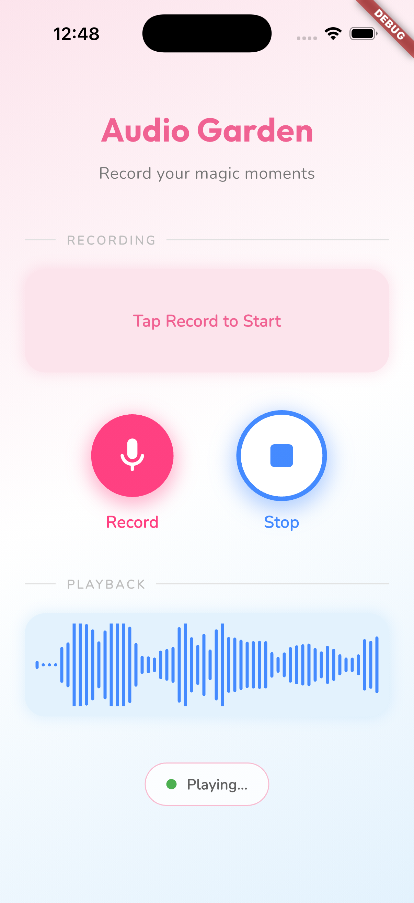
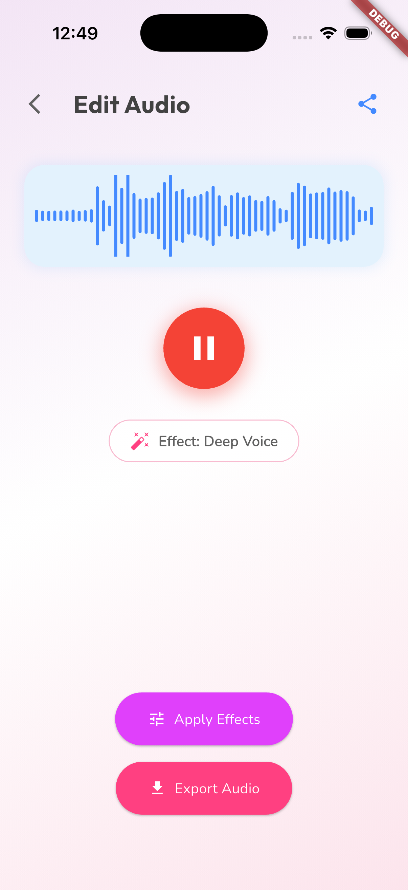
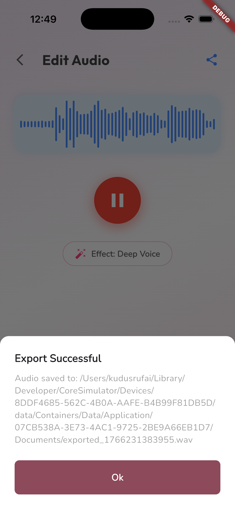

# 🎙️ Stacked Recorder

A beautiful Flutter audio recording and editing app built with clean architecture using the Stacked framework (MVVM pattern).

<div align="center">
  


</div>

## ✨ Features

### 🎤 Recording

- **High-Quality Audio Recording** using the `record` package
- **Real-time Waveform Visualization** during recording
- **Configurable Sample Rates** (16kHz, 24kHz, 44.1kHz)
- **Mono/Stereo Support** with noise suppression options
- **Permission Handling** for microphone access

### 🎵 Playback

- **Low-Latency Playback** powered by `flutter_soloud`
- **Buffer Streaming** for smooth audio playback
- **Waveform Display** during playback
- **Play/Pause Controls** with visual feedback

### 🎨 Audio Editing

- **Voice Effects**:
  - 🐿️ Chipmunk Voice (high pitch)
  - 🦁 Deep Voice (low pitch)
  - 🎯 Normal (original)
- **Effect Preview** with automatic pause
- **Real-time Effect Application** using sample rate manipulation

### 📤 Export & Share

- **Export to Files** - Save edited audio to device storage
- **Share via System Sheet** - Share to Messages, Email, etc.
- **Multiple Format Support** - WAV format with configurable settings

### 🎨 Beautiful UI

- **Pastel Gradient Backgrounds** for a cute aesthetic
- **Google Fonts** (Outfit, Nunito) for modern typography
- **Smooth Animations** using `flutter_animate`
- **Responsive Design** with adaptive layouts
- **Status Indicators** showing recording/playing/idle states

## 📱 Screenshots

<div align="center">

### Recording Screen



### Audio Editor



### Effects Panel



</div>

## 🎬 Demo Video

[View Demo Video](screenshots/screen_rec_1.mov)

> **Note**: Click the link above to download and view the demo video, or convert to GIF for inline display.

## 🏗️ Architecture

This project follows **Clean Architecture** principles with the **Stacked MVVM** pattern:

```
lib/
├── app/                          # App configuration
│   ├── app.dart                  # Stacked routes & dependencies
│   ├── app.locator.dart          # Generated DI container
│   └── app.router.dart           # Generated navigation
├── features/
│   └── record/                   # Recording feature
│       ├── services/             # Business logic layer
│       │   ├── audio_recorder_service.dart
│       │   ├── audio_player_service.dart
│       │   ├── audio_effects_service.dart
│       │   └── audio_export_service.dart
│       ├── viewmodels/           # Presentation logic
│       │   ├── record_viewmodel.dart
│       │   └── audio_editor_viewmodel.dart
│       ├── views/                # UI layer
│       │   ├── record_view.dart
│       │   └── audio_editor_view.dart
│       └── widgets/              # Reusable components
│           ├── action_button.dart
│           ├── waveform_display.dart
│           └── effects_panel.dart
└── main.dart
```

### Key Design Patterns

- **MVVM (Model-View-ViewModel)**: Separation of UI and business logic
- **Dependency Injection**: Using `get_it` via Stacked
- **Service Layer**: Encapsulated audio operations
- **Reactive State Management**: `notifyListeners()` for UI updates

## 🛠️ Tech Stack

| Category         | Package              | Purpose            |
| ---------------- | -------------------- | ------------------ |
| **Architecture** | `stacked`            | MVVM framework     |
| **Navigation**   | `stacked_services`   | Routing & dialogs  |
| **Recording**    | `record`             | Audio capture      |
| **Playback**     | `flutter_soloud`     | Low-latency audio  |
| **Waveforms**    | `audio_waveforms`    | Visualization      |
| **Permissions**  | `permission_handler` | Microphone access  |
| **Storage**      | `path_provider`      | File management    |
| **Sharing**      | `share_plus`         | System share sheet |
| **UI**           | `google_fonts`       | Typography         |
| **Animations**   | `flutter_animate`    | Visual effects     |

## 🚀 Getting Started

### Prerequisites

- Flutter SDK 3.10.0 or higher
- Xcode (for iOS) or Android Studio (for Android)
- Physical device recommended (microphone features limited on simulators)

### Installation

1. **Clone the repository**

   ```bash
   git clone https://github.com/yourusername/stacked_recorder.git
   cd stacked_recorder
   ```

2. **Install dependencies**

   ```bash
   flutter pub get
   ```

3. **Generate code**

   ```bash
   flutter pub run build_runner build --delete-conflicting-outputs
   ```

4. **iOS Setup** (if targeting iOS)

   ```bash
   cd ios && pod install && cd ..
   ```

5. **Run the app**
   ```bash
   flutter run
   ```

## 📝 Configuration

### Recording Settings

Edit `lib/features/record/services/audio_recorder_service.dart`:

```dart
RecordConfig(
  encoder: AudioEncoder.pcm16bits,
  numChannels: 1,              // 1 = mono, 2 = stereo
  noiseSuppress: true,         // Enable noise suppression
  echoCancel: true,            // Enable echo cancellation
  sampleRate: 24000,           // Sample rate in Hz
)
```

### Playback Settings

Edit `lib/features/record/services/audio_player_service.dart`:

```dart
SoLoud.instance.init(
  sampleRate: 24000,           // Match recording sample rate
  channels: Channels.stereo,   // mono or stereo
)
```

## 🎯 Usage

### Recording Audio

1. Tap the **Record** button (pink microphone icon)
2. Speak into your device
3. Tap **Record** again to stop
4. See the waveform visualization in real-time

### Editing Audio

1. After recording, tap **Proceed to Edit**
2. Tap **Apply Effects** to open the effects panel
3. Choose an effect:
   - **Chipmunk**: High-pitched voice
   - **Deep Voice**: Low-pitched voice
   - **Normal**: Original audio
4. Tap **Play** to preview with effects

### Exporting

- Tap the **Export Audio** button to save
- Tap the **Share** icon to share via system sheet

## 🔧 Troubleshooting

### Common Issues

**Audio not recording:**

- Check microphone permissions in device settings
- Ensure `NSMicrophoneUsageDescription` is set in `Info.plist` (iOS)

**Playback crashes:**

- Ensure sample rates match between recording and playback
- Check that WAV files are properly formatted

**Effects not working:**

- Verify `flutter_soloud` is properly initialized
- Check that audio file exists before processing

## 🤝 Contributing

Contributions are welcome! Please feel free to submit a Pull Request.

## 📄 License

This project is open source and available under the MIT License.

## 🙏 Acknowledgments

- Built with [Stacked](https://pub.dev/packages/stacked)
- Audio powered by [flutter_soloud](https://pub.dev/packages/flutter_soloud)
- Recording via [record](https://pub.dev/packages/record)

---

<div align="center">
Made with ❤️ using Flutter
</div>
